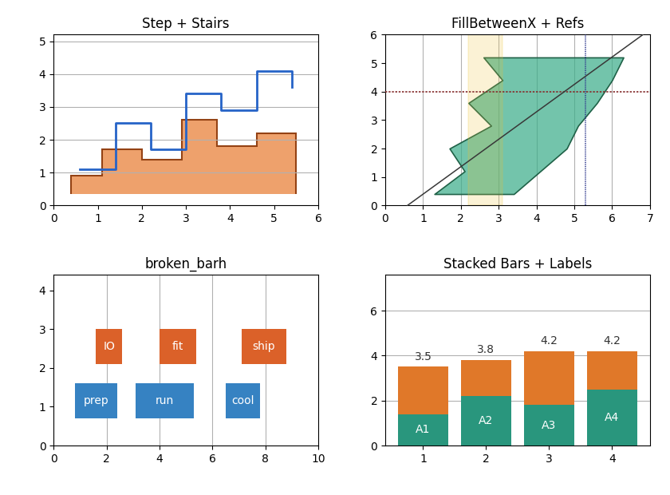
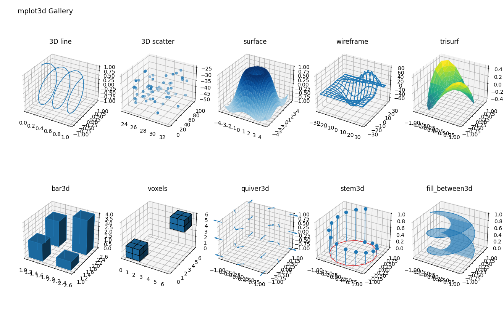

# Matplotlib-Go

A nearly complete, Go-native plotting library inspired by Matplotlib, with broad
2D and 3D coverage. Its renderer-agnostic core supports deterministic raster and
vector output, optional GPU acceleration, and interactive desktop and browser
surfaces. The remaining work is focused on final visual QA and release hardening
for v1.0.

<p align="center">
  
</p>
<p align="center"><sub>Representative 2D plots rendered by Matplotlib-Go's AGG backend.</sub></p>

---

## What It Is Today

Matplotlib-Go has moved beyond the foundational stage. The planned v1.0 surface
is largely implemented:

- **Familiar model:** `Figure → Axes → Artists` hierarchy
- **Broad plotting surface:** 2D, 3D, statistical, image, contour, projection,
  annotation, layout, and widget APIs
- **Renderer independence:** high-quality AGG raster output, a pure-Go fallback,
  SVG/PDF/PS/PGF vector backends, and opt-in Skia CPU/GPU modes
- **Deterministic results:** pinned fonts, golden images, and catalog-driven
  comparisons against Matplotlib 3.10.9
- **Production-quality text:** precise metrics, font fallback, MathText, and
  optional TeX rendering
- **Go-idiomatic API:** explicit figures and options, a frozen pre-v1 public
  surface, and an optional `pyplot` shim for scripting
- **Cross-platform interactivity:** pan/zoom, picking, animations, widgets,
  desktop canvases, and a WASM browser gallery

---

## Design Principles

- **Backend-agnostic core:** all plot logic independent of rendering technology
- **Determinism:** golden image tests, locked fonts, stable outputs
- **Minimal global state:** figures and axes are explicit values, not hidden globals
- **Extensibility:** artists, colormaps, and backends are pluggable
- **Quality-first:** correctness, readability, and sharp rendering over premature optimization
- **Interoperability:** ability to export or consume simple plot specifications (for testing or migration)

---

## Path to v1.0

Most of the original end-state goals are now implemented. The remaining release
work is deliberately narrow:

- Close or explicitly disposition the last known visual differences from
  Matplotlib.
- Ratchet every parity tolerance against the final rendered output.
- Revalidate the frozen API, golden images, installation path, documentation,
  CI, and performance baselines.
- Tag v1.0.

See [`PLAN.md`](PLAN.md) for the active release checklist and
the [Matplotlib-to-Go migration notes](docs/matplotlib-migration-notes.md) for
the pre-v1 API changes.

---

## Chart Types

The current plotting surface is organized around Matplotlib-style `Axes`
methods. Supported chart classes include:

- **Line and marker plots:** regular line plots, multi-series plots, markers,
  dashed lines, step plots, stairs, reference lines, horizontal/vertical spans,
  and broken horizontal bars via `Plot`, `SemilogX`, `SemilogY`, `LogLog`,
  `Step`, `Stairs`, `AxHLine`, `AxVLine`, `AxLine`, `AxHSpan`, `AxVSpan`, and
  `BrokenBarH`.
- **Scatter and point-cloud plots:** scatter plots with marker, size, color,
  alpha, and large collection support via `Scatter`.
- **Bar and category charts:** vertical bars, horizontal bars, grouped bars,
  categorical/date/unit-aware bars, and bar labels via `Bar`, `BarH`,
  and `BarLabel`.
- **Area and filled-region charts:** filled polygons, fill-to-baseline,
  fill-between curves, horizontal fill-between, and stacked area charts via
  `Fill`, `FillToBaseline`, `FillBetween`, `FillBetweenX`, and `StackPlot`.
- **Distribution and statistical charts:** histograms, multi-histograms,
  2D histograms, box plots, violin plots, empirical CDFs, and event plots via
  `Hist`, `HistMulti`, `Hist2D`, `BoxPlot`, `BoxPlots`, `Violinplot`, `ECDF`,
  and `Eventplot`.
- **Uncertainty and stem plots:** error bars and stem plots via `ErrorBar` and
  `Stem`.
- **Image, matrix, and heatmap plots:** image arrays, imshow-style plots,
  matrix display, sparsity plots, annotated heatmaps, alpha/interpolation
  variants, and colorbars via `Image`, `ImShow`, `MatShow`, `Spy`,
  `AnnotatedHeatmap`, and `AddColorbar`.
- **Mesh, contour, and unstructured data plots:** pseudocolor meshes, fast
  pcolor, contour and filled-contour plots, triangulation wire plots,
  tripcolor, and tricontour variants via `PColor`, `PColorFast`, `PColorMesh`,
  `Contour`, `Contourf`, `TriPlot`, `TriColor`, `TriContour`, and
  `TriContourf`.
- **Vector-field plots:** quiver arrows, quiver keys, wind barbs, streamplots,
  and grid-based vector inputs via `Quiver`, `QuiverGrid`, `QuiverKey`,
  `Barbs`, `BarbsGrid`, and `Streamplot`.
- **Signal-analysis plots:** spectrograms, PSD, magnitude/angle/phase spectra,
  CSD, coherence, autocorrelation, and cross-correlation via `Specgram`, `PSD`,
  `MagnitudeSpectrum`, `AngleSpectrum`, `PhaseSpectrum`, `CSD`, `Cohere`,
  `ACorr`, and `XCorr`.
- **Specialty charts:** pie charts, hexbin density plots, tables, radar charts,
  Sankey-style flows, and custom patches via `Pie`, `Hexbin`, `Table`,
  `NewSankey`, radar projection helpers, and patch/artist APIs.
- **Projection charts:** polar axes, radar axes, geographic projections
  including Aitoff, Hammer, Lambert, and Mollweide, plus Skew-T style axes.
- **3D chart classes:** 3D line, scatter, surface, wireframe, contours,
  triangulated surface, bars, voxels, quiver, stem, error bars, fill-between,
  and terrain examples via `AddAxes3D`, `Plot3D`, `Scatter3D`, `Surface`,
  `Wireframe`, `Contour`, `Contourf`, `Trisurf`, `Bar3D`, `Voxels`,
  `Quiver3D`, `Stem3D`, `ErrorBar3D`, and `FillBetween3D`.
- **Text, annotation, and composition views:** titles, labels, MathText,
  annotations, legends, inset axes, axes-grid layouts, figure labels, colorbar
  composition, and axis-artist style layouts.
- **Interactive/widget surfaces:** buttons, sliders, range sliders, text boxes,
  check/radio buttons, selectors, cursors, multi-cursors, and animation
  scaffolding for interactive backends.

<p align="center">
  
</p>
<p align="center"><sub>3D lines, collections, surfaces, bars, voxels, and vector fields from the catalog-driven gallery.</sub></p>

The curated examples gallery shows representative plots for these classes and
is the best way to check the current visual coverage.

---

## Testing

This project uses golden image testing to ensure visual consistency across platforms and detect rendering regressions.

### Running Tests

```bash
# Run all tests
just test

# Run only golden image tests
go test -tags freetype ./test/

# Update golden images when making intentional changes
go test -tags freetype ./test/ -update-golden
```

### Golden Image Testing

Golden tests compare rendered output against reference images stored in `testdata/golden/`. Matplotlib parity and text-layout checks use committed reference images from `testdata/matplotlib_ref/`. When tests fail, debug artifacts are saved to `testdata/_artifacts/` and uploaded by CI:

- `*_got.png`: Actual rendered output
- `*_want.png`: Expected golden reference
- `*_diff.png`: Visual diff highlighting changes

The comparison uses pixel-perfect RGBA matching with configurable tolerance (typically ±1 LSB) and reports PSNR metrics for quality assessment.

To refresh the committed Matplotlib reference images intentionally:

```bash
go test -tags freetype ./test/... -run TestMpl -update-matplotlib
```

## Examples Gallery

The curated examples gallery is the best starting point for seeing the current
plot vocabulary. It is catalog-driven: the browser gallery, CLI renderer,
golden tests, and Matplotlib reference comparisons all use the same showcase
entries. See [`docs/examples-gallery.md`](docs/examples-gallery.md) for the
gallery workflow and the anti-gallery of intentional Matplotlib divergences.

List and render examples from the command line with:

```bash
go run ./cmd/example -list
go run ./cmd/example -name basic_line -o basic_line.png
```

### Browser Gallery

The repository now includes a browser demo under [`web/`](web) backed by Go
compiled to WebAssembly from [`cmd/wasm`](cmd/wasm).

Build the web artifact locally with:

```bash
just web-build
```

`web/main.wasm` and `web/wasm_exec.js` are generated build outputs. Re-run
`just web-build` before serving `web/`, especially after changes under
[`cmd/wasm`](cmd/wasm) or the browser bridge, or the page may report an
incompatible WASM build.

Then serve the `web/` directory with any static file server, for example:

```bash
python3 -m http.server 8000 --directory web
```

The same demo catalog can also be rendered directly to PNGs without serving the
HTML page:

```bash
go run -tags freetype ./cmd/webdemoexport --output-dir testdata/_artifacts/webdemo/go
```

To compare those direct Go exports against Matplotlib references for the same
demo source, generate both image sets and open the parity viewer:

```bash
just web-parity-update
just parity-viewer-all
```

Use `just parity-viewer` for only the standard golden/reference suite, or
`just web-parity-viewer` for only the browser-demo suite.

The GitHub Actions workflow [`.github/workflows/deploy-wasm.yml`](.github/workflows/deploy-wasm.yml)
builds the same artifact and deploys it to GitHub Pages on pushes to `main`.

---

🚀 _Plotting for Go, without compromise._
